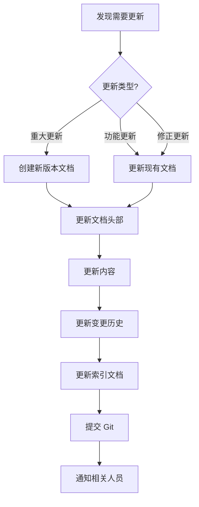
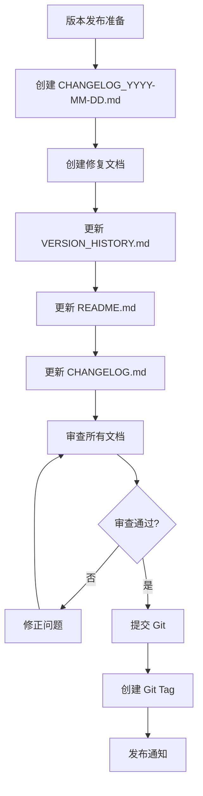

# 文档维护指南 / Documentation Maintenance Guide

**版本**: v1.0  
**最后更新**: 2026-04-27  
**维护者**: Multi-Agent RAG Team

---

## 📋 目录

1. [文档结构](#文档结构)
2. [文档生命周期](#文档生命周期)
3. [文档更新流程](#文档更新流程)
4. [文档审查清单](#文档审查清单)
5. [文档归档策略](#文档归档策略)
6. [常见问题](#常见问题)

---

## 📁 文档结构

### 当前文档组织

```
docs/
├── README.md                          # 英文文档索引
├── README_CN.md                       # 中文文档索引（新增）
├── VERSION_HISTORY.md                 # 版本历史（新增）
├── DOCUMENTATION_MAINTENANCE.md       # 本文档（新增）
│
├── 用户指南/
│   ├── API_SETTINGS_GUIDE.md
│   ├── 如何找到API设置.md
│   ├── claude-api-setup.md
│   └── workflow_lowcode_setup.md
│
├── 架构设计/
│   ├── PERFORMANCE_OPTIMIZATION.md
│   ├── runtime_speed_profiles.md
│   └── superpowers/specs/
│       └── 2026-04-19-query-to-answer-ux-speed-design.md
│
├── 运维部署/
│   ├── production_readiness_checklist.md
│   └── 网络功能检查报告.md
│
├── 开发规范/
│   ├── DOCUMENTATION_STANDARD.md
│   └── DOCUMENT_VERSION_CONTROL.md
│
├── 版本历史/
│   ├── CHANGELOG_2026-04-27.md
│   ├── FINAL_FIXES_SUMMARY_2026-04-27.md
│   ├── DEEP_CODE_REVIEW_2026-04-27.md
│   ├── FIXES_INDEX.md
│   ├── LOGIC_FIXES_2026-04-27.md
│   ├── FIXES_ROUND2_2026-04-27.md
│   ├── FIXES_ROUND3_2026-04-27.md
│   ├── FIXES_ROUND4_2026-04-27.md
│   └── 2026-04-26-documentation-update-summary.md
│
└── 历史文档/
    └── fixes/
        └── 2026-04-26-routing-rag-fixes.md
```

### 文档分类规则

| 类别 | 命名规则 | 存放位置 | 示例 |
|------|----------|----------|------|
| **索引文档** | `README*.md` | `docs/` | `README.md`, `README_CN.md` |
| **版本文档** | `VERSION_*.md` | `docs/` | `VERSION_HISTORY.md` |
| **变更日志** | `CHANGELOG_YYYY-MM-DD.md` | `docs/` | `CHANGELOG_2026-04-27.md` |
| **修复文档** | `FIXES_*.md` 或 `*_FIXES_*.md` | `docs/` | `LOGIC_FIXES_2026-04-27.md` |
| **用户指南** | `*_GUIDE.md` 或描述性名称 | `docs/` | `API_SETTINGS_GUIDE.md` |
| **架构设计** | `*_OPTIMIZATION.md` 或 `*_profiles.md` | `docs/` | `PERFORMANCE_OPTIMIZATION.md` |
| **设计规范** | `YYYY-MM-DD-*.md` | `docs/superpowers/specs/` | `2026-04-19-query-to-answer-ux-speed-design.md` |
| **运维文档** | `*_checklist.md` 或 `*报告.md` | `docs/` | `production_readiness_checklist.md` |
| **开发规范** | `*_STANDARD.md` 或 `*_CONTROL.md` | `docs/` | `DOCUMENTATION_STANDARD.md` |
| **历史文档** | 任意 | `docs/fixes/` 或 `docs/archive/` | `2026-04-26-routing-rag-fixes.md` |

---

## 🔄 文档生命周期

### 1. 创建阶段

#### 何时创建新文档
- ✅ 新功能发布
- ✅ 重大 bug 修复
- ✅ 架构变更
- ✅ 用户指南更新
- ✅ 版本发布

#### 创建流程
```bash
# 1. 确定文档类型和命名
# 2. 使用模板创建文档
# 3. 填写文档头部元信息
# 4. 编写文档内容
# 5. 更新索引文档
# 6. 提交 Git
```

#### 文档头部模板
```markdown
# 文档标题

**版本**: v1.0  
**创建日期**: YYYY-MM-DD  
**最后更新**: YYYY-MM-DD  
**作者**: 作者名  
**审查者**: 审查者名  
**状态**: 草稿 / 审查中 / 已发布 / 已归档

---

## 变更历史

| 版本 | 日期 | 作者 | 变更说明 |
|------|------|------|----------|
| v1.0 | YYYY-MM-DD | 作者名 | 初始版本 |

---
```

### 2. 维护阶段

#### 何时更新文档
- ✅ 功能变更
- ✅ Bug 修复
- ✅ 配置变更
- ✅ API 变更
- ✅ 用户反馈
- ✅ 定期审查（每月）

#### 更新流程
```bash
# 1. 检查文档当前状态
# 2. 确定需要更新的部分
# 3. 更新内容
# 4. 更新"最后更新"日期
# 5. 在变更历史中添加记录
# 6. 更新相关索引
# 7. 提交 Git
```

#### 更新类型
| 类型 | 版本变更 | 示例 |
|------|----------|------|
| **重大更新** | v1.0 → v2.0 | 架构重构、API 不兼容变更 |
| **功能更新** | v1.0 → v1.1 | 新增章节、功能说明 |
| **修正更新** | v1.0 → v1.0.1 | 错误修正、链接修复 |

### 3. 审查阶段

#### 定期审查计划
- **每周**: 检查最近 7 天的文档变更
- **每月**: 全面审查所有活跃文档
- **每季度**: 审查归档策略和文档结构

#### 审查清单
- [ ] 内容准确性
- [ ] 技术正确性
- [ ] 链接有效性
- [ ] 格式一致性
- [ ] 示例代码可运行
- [ ] 截图和图表最新
- [ ] 语言和语法
- [ ] 索引更新

### 4. 归档阶段

#### 何时归档文档
- ✅ 功能已废弃
- ✅ 版本已过时（>6 个月）
- ✅ 内容已被新文档替代
- ✅ 不再维护

#### 归档流程
```bash
# 1. 在文档头部标记"已归档"状态
# 2. 添加归档原因和替代文档链接
# 3. 移动到 docs/archive/ 目录
# 4. 从索引文档中移除
# 5. 在 VERSION_HISTORY.md 中记录
# 6. 提交 Git
```

#### 归档标记模板
```markdown
> ⚠️ **归档通知**  
> 本文档已于 YYYY-MM-DD 归档。  
> **归档原因**: 功能已废弃 / 版本过时 / 已被替代  
> **替代文档**: [新文档链接](path/to/new-doc.md)  
> **历史参考**: 本文档保留用于历史参考
```

---

## 📝 文档更新流程

### 日常更新流程



### 版本发布流程



### Git 提交规范

```bash
# 文档创建
git commit -m "docs: add <document-name> for <purpose>"

# 文档更新
git commit -m "docs: update <document-name> - <change-summary>"

# 文档修正
git commit -m "docs: fix <issue> in <document-name>"

# 文档归档
git commit -m "docs: archive <document-name> - <reason>"

# 文档重构
git commit -m "docs: refactor documentation structure"
```

---

## ✅ 文档审查清单

### 内容审查

#### 技术准确性
- [ ] 所有技术信息准确无误
- [ ] API 示例可以运行
- [ ] 配置示例正确
- [ ] 命令行示例经过验证
- [ ] 版本号和日期正确

#### 完整性
- [ ] 所有必要章节都已包含
- [ ] 没有遗漏重要信息
- [ ] 示例代码完整
- [ ] 错误处理说明完整
- [ ] 已知限制已说明

#### 可读性
- [ ] 结构清晰，层次分明
- [ ] 语言简洁明了
- [ ] 术语使用一致
- [ ] 格式统一
- [ ] 适当使用图表和示例

### 格式审查

#### Markdown 格式
- [ ] 标题层级正确（# ## ### ####）
- [ ] 代码块使用正确的语言标识
- [ ] 列表格式一致
- [ ] 表格格式正确
- [ ] 链接格式正确

#### 文档结构
- [ ] 文档头部信息完整
- [ ] 目录（如需要）正确
- [ ] 章节编号一致
- [ ] 变更历史更新
- [ ] 页脚信息完整

### 链接审查

#### 内部链接
- [ ] 所有内部链接有效
- [ ] 相对路径正确
- [ ] 锚点链接正确
- [ ] 文件引用存在

#### 外部链接
- [ ] 所有外部链接可访问
- [ ] 链接指向正确的资源
- [ ] 链接没有过期
- [ ] 使用 HTTPS（如可能）

### 示例审查

#### 代码示例
- [ ] 代码可以运行
- [ ] 代码遵循项目规范
- [ ] 代码包含必要注释
- [ ] 代码处理错误情况
- [ ] 代码使用最新 API

#### 配置示例
- [ ] 配置文件格式正确
- [ ] 配置项完整
- [ ] 默认值合理
- [ ] 包含注释说明
- [ ] 安全配置正确

---

## 📦 文档归档策略

### 归档触发条件

#### 自动归档
- 文档创建 > 6 个月且无更新
- 对应功能已从代码库移除
- 版本号 < 当前版本 - 2

#### 手动归档
- 功能废弃公告后 30 天
- 被新文档完全替代
- 维护者决定不再维护

### 归档流程

```bash
# 1. 创建归档目录（如不存在）
mkdir -p docs/archive/YYYY-MM

# 2. 在文档头部添加归档标记
# 3. 移动文档到归档目录
mv docs/OLD_DOC.md docs/archive/YYYY-MM/

# 4. 更新索引文档
# 移除或标记为已归档

# 5. 创建重定向文档（可选）
cat > docs/OLD_DOC.md << EOF
# 文档已归档

本文档已归档，请参考：
- [新文档](path/to/new-doc.md)
- [归档版本](archive/YYYY-MM/OLD_DOC.md)
EOF

# 6. 提交 Git
git add .
git commit -m "docs: archive OLD_DOC.md - reason"
```

### 归档保留策略

| 文档类型 | 保留期限 | 说明 |
|----------|----------|------|
| **版本文档** | 永久 | 所有版本的 CHANGELOG 和修复文档 |
| **用户指南** | 2 年 | 废弃功能的用户指南 |
| **架构设计** | 永久 | 架构演进的历史记录 |
| **运维文档** | 1 年 | 过时的运维文档 |
| **临时文档** | 6 个月 | 临时性的文档 |

---

## 🔍 文档质量指标

### 量化指标

#### 覆盖率
```
文档覆盖率 = (已文档化的功能数 / 总功能数) × 100%
目标: ≥ 90%
```

#### 更新频率
```
平均更新间隔 = 总天数 / 更新次数
目标: ≤ 30 天
```

#### 链接有效性
```
链接有效率 = (有效链接数 / 总链接数) × 100%
目标: ≥ 95%
```

### 质量评分

| 维度 | 权重 | 评分标准 |
|------|------|----------|
| **准确性** | 30% | 技术信息准确，示例可运行 |
| **完整性** | 25% | 覆盖所有必要内容 |
| **可读性** | 20% | 结构清晰，语言简洁 |
| **时效性** | 15% | 内容最新，定期更新 |
| **可维护性** | 10% | 格式规范，易于维护 |

**总分计算**: 加权平均  
**目标**: ≥ 85 分

---

## 🛠️ 文档工具

### 推荐工具

#### Markdown 编辑器
- **VS Code** + Markdown 插件
- **Typora** (所见即所得)
- **MarkText** (开源)

#### 链接检查
```bash
# 使用 markdown-link-check
npm install -g markdown-link-check
markdown-link-check docs/**/*.md
```

#### 格式检查
```bash
# 使用 markdownlint
npm install -g markdownlint-cli
markdownlint docs/**/*.md
```

#### 拼写检查
```bash
# 使用 cspell
npm install -g cspell
cspell docs/**/*.md
```

### 自动化脚本

#### 文档统计脚本
```bash
#!/bin/bash
# scripts/doc_stats.sh

echo "=== 文档统计 ==="
echo "总文档数: $(find docs -name "*.md" | wc -l)"
echo "总字数: $(find docs -name "*.md" -exec wc -w {} + | tail -1 | awk '{print $1}')"
echo "最近更新: $(find docs -name "*.md" -type f -printf '%T+ %p\n' | sort -r | head -5)"
```

#### 链接检查脚本
```bash
#!/bin/bash
# scripts/check_links.sh

echo "=== 检查文档链接 ==="
find docs -name "*.md" -exec markdown-link-check {} \;
```

---

## ❓ 常见问题

### Q1: 何时创建新文档 vs 更新现有文档？

**创建新文档**:
- 新功能或新版本
- 主题与现有文档不同
- 现有文档已过长（>1000 行）

**更新现有文档**:
- 功能改进或 bug 修复
- 补充说明或示例
- 修正错误

### Q2: 如何处理多语言文档？

**推荐方式**:
- 主文档使用英文（`DOC.md`）
- 翻译版本添加语言后缀（`DOC_CN.md`, `DOC_JP.md`）
- 在主文档头部添加翻译链接
- 保持翻译版本与主文档同步

### Q3: 如何处理文档中的敏感信息？

**安全原则**:
- ❌ 不要包含真实的 API 密钥
- ❌ 不要包含真实的密码
- ❌ 不要包含内部 IP 地址
- ✅ 使用占位符（`YOUR_API_KEY`, `<password>`）
- ✅ 使用示例域名（`example.com`）
- ✅ 使用私有 IP 范围（`192.168.x.x`）

### Q4: 如何处理文档版本冲突？

**解决步骤**:
1. 拉取最新版本：`git pull origin main`
2. 查看冲突：`git status`
3. 手动解决冲突
4. 保留两个版本的有价值内容
5. 更新变更历史
6. 提交合并：`git commit -m "docs: merge conflict in <doc>"`

### Q5: 如何确保文档与代码同步？

**最佳实践**:
- 代码变更时同时更新文档
- PR 审查时检查文档更新
- 使用 CI 检查文档链接
- 定期审查文档准确性
- 在代码注释中引用文档

---

## 📞 获取帮助

### 文档问题反馈
- **GitHub Issues**: 标记为 `documentation`
- **邮件**: docs@your-org.com
- **Slack**: #documentation 频道

### 文档贡献
- 阅读 [DOCUMENTATION_STANDARD.md](DOCUMENTATION_STANDARD.md)
- 阅读 [DOCUMENT_VERSION_CONTROL.md](DOCUMENT_VERSION_CONTROL.md)
- 提交 Pull Request

---

## 📅 维护计划

### 每周任务
- [ ] 检查最近 7 天的文档变更
- [ ] 审查新创建的文档
- [ ] 修复报告的文档问题

### 每月任务
- [ ] 全面审查所有活跃文档
- [ ] 检查所有链接有效性
- [ ] 更新过时的截图和示例
- [ ] 统计文档质量指标

### 每季度任务
- [ ] 审查文档结构
- [ ] 评估归档策略
- [ ] 更新文档工具
- [ ] 培训新的文档维护者

---

**维护者**: Multi-Agent RAG Team  
**最后更新**: 2026-04-27  
**文档版本**: v1.0

---

## 变更历史

| 版本 | 日期 | 作者 | 变更说明 |
|------|------|------|----------|
| v1.0 | 2026-04-27 | Claude | 初始版本 |
