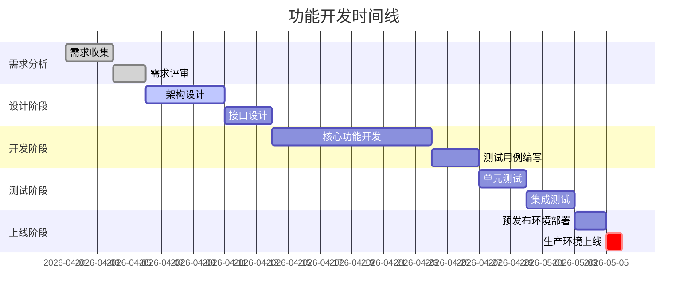
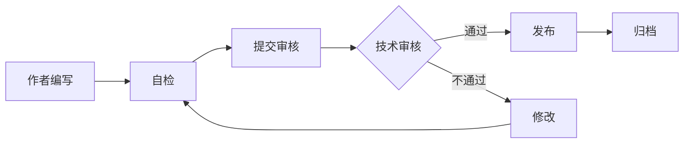

# 文档标准规范

**文档版本**: v1.0.0  
**制定日期**: 2026-04-26  
**适用范围**: Multi-Agent Local RAG System 所有技术文档  
**维护团队**: 技术文档组  
**审核周期**: 季度审核

---

## 目录

- [1. 文档分类体系](#1-文档分类体系)
- [2. 文档结构标准](#2-文档结构标准)
- [3. 版本控制规范](#3-版本控制规范)
- [4. 时间线管理](#4-时间线管理)
- [5. 文档模板](#5-文档模板)
- [6. 审核流程](#6-审核流程)

---

## 1. 文档分类体系

### 1.1 文档类型

| 类型 | 目录 | 命名规范 | 用途 |
|------|------|----------|------|
| **技术规范** | `docs/specs/` | `YYYY-MM-DD-{feature}-spec.md` | 功能设计、架构设计 |
| **修复报告** | `docs/fixes/` | `YYYY-MM-DD-{component}-fixes.md` | Bug修复、性能优化 |
| **操作指南** | `docs/guides/` | `{topic}-guide.md` | 部署、配置、使用指南 |
| **测试报告** | `docs/testing/` | `YYYY-MM-DD-{test-type}-report.md` | 测试结果、质量报告 |
| **变更记录** | 根目录 | `CHANGELOG.md` | 版本变更历史 |
| **API文档** | `docs/api/` | `{service}-api.md` | API接口文档 |

### 1.2 文档优先级

- **P0 - 关键文档**: CLAUDE.md, README.md, CHANGELOG.md
- **P1 - 核心文档**: 架构设计、API文档、部署指南
- **P2 - 重要文档**: 功能规范、测试报告、修复记录
- **P3 - 辅助文档**: 开发笔记、临时记录

---

## 2. 文档结构标准

### 2.1 必需元数据区块

所有文档必须包含以下元数据：

```markdown
# {文档标题}

**文档编号**: DOC-{YYYYMMDD}-{序号}  
**文档版本**: v{major}.{minor}.{patch}  
**创建日期**: YYYY-MM-DD  
**最后更新**: YYYY-MM-DD  
**文档状态**: [草稿|审核中|已发布|已归档]  
**作者**: {作者名称}  
**审核人**: {审核人名称}  
**关联版本**: v{系统版本}  
**相关文档**: [链接到相关文档]

---

## 文档摘要

{100-200字的文档摘要，说明文档目的、范围和主要内容}

---

## 目录

{自动生成的目录}

---
```

### 2.2 标准章节结构

#### 技术规范文档

```markdown
## 1. 概述
### 1.1 背景
### 1.2 目标
### 1.3 范围

## 2. 需求分析
### 2.1 功能需求
### 2.2 非功能需求
### 2.3 约束条件

## 3. 技术方案
### 3.1 架构设计
### 3.2 接口设计
### 3.3 数据模型

## 4. 实施计划
### 4.1 开发阶段
### 4.2 测试计划
### 4.3 上线计划

## 5. 风险评估
### 5.1 技术风险
### 5.2 进度风险
### 5.3 缓解措施

## 6. 附录
### 6.1 参考资料
### 6.2 术语表
### 6.3 变更历史
```

#### 修复报告文档

```markdown
## 1. 执行摘要
### 1.1 修复概览
### 1.2 影响范围
### 1.3 关键指标

## 2. 问题分析
### 2.1 问题描述
### 2.2 根因分析
### 2.3 影响评估

## 3. 修复方案
### 3.1 技术方案
### 3.2 代码变更
### 3.3 测试验证

## 4. 实施记录
### 4.1 实施步骤
### 4.2 验证结果
### 4.3 回滚方案

## 5. 效果评估
### 5.1 性能指标
### 5.2 质量指标
### 5.3 用户反馈

## 6. 后续行动
### 6.1 监控计划
### 6.2 优化建议
### 6.3 经验总结
```

#### 测试报告文档

```markdown
## 1. 测试概述
### 1.1 测试目标
### 1.2 测试范围
### 1.3 测试环境

## 2. 测试执行
### 2.1 测试用例
### 2.2 执行记录
### 2.3 缺陷统计

## 3. 测试结果
### 3.1 功能测试
### 3.2 性能测试
### 3.3 安全测试

## 4. 质量评估
### 4.1 通过率
### 4.2 覆盖率
### 4.3 风险评级

## 5. 结论与建议
### 5.1 测试结论
### 5.2 遗留问题
### 5.3 改进建议
```

---

## 3. 版本控制规范

### 3.1 版本号规则

采用语义化版本控制 (Semantic Versioning):

```
v{MAJOR}.{MINOR}.{PATCH}

MAJOR: 重大架构变更、不兼容更新
MINOR: 新增功能、向后兼容
PATCH: Bug修复、文档更新
```

### 3.2 版本状态

| 状态 | 说明 | 标识 |
|------|------|------|
| **草稿** | 初始编写，未完成 | `[DRAFT]` |
| **审核中** | 等待审核 | `[REVIEW]` |
| **已发布** | 正式发布 | `[PUBLISHED]` |
| **已废弃** | 不再维护 | `[DEPRECATED]` |
| **已归档** | 历史存档 | `[ARCHIVED]` |

### 3.3 变更历史记录

每个文档末尾必须包含变更历史：

```markdown
---

## 变更历史

| 版本 | 日期 | 作者 | 变更说明 | 审核人 |
|------|------|------|----------|--------|
| v1.0.0 | 2026-04-26 | 张三 | 初始版本 | 李四 |
| v1.1.0 | 2026-04-27 | 张三 | 新增第3章 | 李四 |
| v1.1.1 | 2026-04-28 | 王五 | 修正错误 | 李四 |
```

---

## 4. 时间线管理

### 4.1 项目时间线

所有重要文档应包含时间线章节：

```markdown
## 项目时间线


\`\`\`

### 4.2 里程碑管理

```markdown
## 关键里程碑

| 里程碑 | 计划日期 | 实际日期 | 状态 | 负责人 | 备注 |
|--------|----------|----------|------|--------|------|
| 需求评审完成 | 2026-04-05 | 2026-04-05 | ✅ 完成 | 张三 | 按时完成 |
| 设计评审完成 | 2026-04-12 | 2026-04-13 | ✅ 完成 | 李四 | 延迟1天 |
| 开发完成 | 2026-04-24 | - | 🔄 进行中 | 王五 | 进度正常 |
| 测试完成 | 2026-05-01 | - | ⏳ 待开始 | 赵六 | - |
| 生产上线 | 2026-05-04 | - | ⏳ 待开始 | 张三 | - |
```

### 4.3 决策记录

重要决策应记录在文档中：

```markdown
## 决策记录

### 决策 #001: 选择 DuckDuckGo 作为网络搜索引擎

**日期**: 2026-04-20  
**决策人**: 技术委员会  
**参与人**: 张三、李四、王五

**背景**:
系统需要集成网络搜索功能以补充本地知识库。

**备选方案**:
1. Google Custom Search API (付费)
2. Bing Search API (付费)
3. DuckDuckGo Search (免费)
4. SerpAPI (付费)

**决策**:
选择 DuckDuckGo Search (ddgs 库)

**理由**:
- ✅ 免费开源，无需 API key
- ✅ 隐私保护，不追踪用户
- ✅ 简单易用，集成快速
- ✅ 满足当前需求
- ⚠️ 限制：无高级搜索功能、QPS 限制

**影响**:
- 开发成本降低
- 无需管理 API 配额
- 可能需要后续升级到付费方案

**后续行动**:
- 监控搜索质量和可用性
- 准备备用方案（SerpAPI）
- 6个月后重新评估

**状态**: ✅ 已实施
```

---

## 5. 文档模板

### 5.1 技术规范模板

参见: [docs/templates/spec-template.md](templates/spec-template.md)

### 5.2 修复报告模板

参见: [docs/templates/fix-report-template.md](templates/fix-report-template.md)

### 5.3 测试报告模板

参见: [docs/templates/test-report-template.md](templates/test-report-template.md)

### 5.4 操作指南模板

参见: [docs/templates/guide-template.md](templates/guide-template.md)

---

## 6. 审核流程

### 6.1 审核标准

文档审核检查清单：

- [ ] **元数据完整**: 包含所有必需的元数据字段
- [ ] **结构规范**: 遵循标准章节结构
- [ ] **内容准确**: 技术内容准确无误
- [ ] **格式统一**: Markdown 格式规范
- [ ] **链接有效**: 所有内部外部链接可访问
- [ ] **代码示例**: 代码示例可运行
- [ ] **图表清晰**: 图表、表格清晰易读
- [ ] **术语一致**: 术语使用一致
- [ ] **无敏感信息**: 不包含密码、密钥等敏感信息
- [ ] **版本标记**: 正确标记文档版本和状态

### 6.2 审核流程



### 6.3 审核角色

| 角色 | 职责 | 权限 |
|------|------|------|
| **作者** | 编写文档、响应审核意见 | 创建、编辑草稿 |
| **技术审核人** | 审核技术准确性 | 批准、退回 |
| **文档管理员** | 维护文档体系、发布文档 | 发布、归档 |

---

## 7. 文档维护

### 7.1 定期审核

- **季度审核**: 每季度审核所有 P0/P1 文档
- **年度审核**: 每年审核所有文档，归档过期文档
- **触发审核**: 系统重大变更时审核相关文档

### 7.2 文档更新触发条件

- 系统版本发布
- 架构重大变更
- API 接口变更
- 安全漏洞修复
- 性能优化完成
- 用户反馈问题

### 7.3 文档归档规则

满足以下条件的文档应归档：

- 功能已下线或废弃
- 被新文档完全替代
- 超过 2 年未更新且不再适用
- 标记为 `[DEPRECATED]` 超过 6 个月

归档路径: `docs/archive/YYYY/`

---

## 8. 工具和资源

### 8.1 推荐工具

- **Markdown 编辑器**: VS Code + Markdown All in One
- **图表工具**: Mermaid, Draw.io
- **版本控制**: Git
- **文档生成**: MkDocs, Docusaurus

### 8.2 参考资源

- [Markdown 语法指南](https://www.markdownguide.org/)
- [语义化版本控制](https://semver.org/lang/zh-CN/)
- [Keep a Changelog](https://keepachangelog.com/zh-CN/)
- [Google 技术写作指南](https://developers.google.com/tech-writing)

---

## 9. 附录

### 9.1 术语表

| 术语 | 定义 |
|------|------|
| **RAG** | Retrieval-Augmented Generation，检索增强生成 |
| **LLM** | Large Language Model，大语言模型 |
| **P0/P1/P2/P3** | 优先级分级，P0 最高 |
| **SLA** | Service Level Agreement，服务级别协议 |
| **SLO** | Service Level Objective，服务级别目标 |

### 9.2 常见问题

**Q: 如何选择文档类型？**  
A: 根据文档用途选择：设计用规范、修复用报告、使用用指南。

**Q: 文档版本号如何递增？**  
A: 重大变更递增 MAJOR，新增内容递增 MINOR，修正错误递增 PATCH。

**Q: 文档审核需要多长时间？**  
A: 通常 1-3 个工作日，紧急文档可加急审核。

---

## 变更历史

| 版本 | 日期 | 作者 | 变更说明 | 审核人 |
|------|------|------|----------|--------|
| v1.0.0 | 2026-04-26 | 系统 | 初始版本，建立文档标准体系 | - |

---

**文档状态**: [PUBLISHED]  
**下次审核日期**: 2026-07-26
