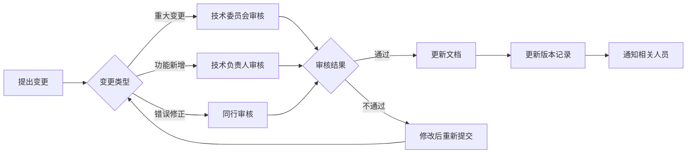

# 文档版本控制记录

**文档版本**: v1.0.0  
**创建日期**: 2026-04-26  
**维护团队**: 技术文档组  
**审核周期**: 季度审核

---

## 版本控制说明

本文件记录所有技术文档的版本历史、审核状态和变更记录。遵循语义化版本控制规范（Semantic Versioning）。

---

## 文档版本总览

### 核心文档

#### CLAUDE.md

| 版本 | 日期 | 作者 | 变更说明 | 状态 |
|------|------|------|----------|------|
| v0.2.4 | 2026-04-26 | 技术团队 | 更新至 v0.2.4 系统版本 | ✅ 最新 |
| v0.2.2 | 2026-04-09 | 技术团队 | 添加运行时弹性模块说明 | 📋 已归档 |
| v0.2.0 | 2026-04-01 | 技术团队 | 初始版本 | 📋 已归档 |

**下次审核**: 2026-05-26  
**审核人**: 技术负责人

#### README.md

| 版本 | 日期 | 作者 | 变更说明 | 状态 |
|------|------|------|----------|------|
| v0.2.4 | 2026-04-26 | 技术团队 | 更新项目介绍和快速开始 | ✅ 最新 |
| v0.2.0 | 2026-04-01 | 技术团队 | 初始版本 | 📋 已归档 |

**下次审核**: 2026-05-26  
**审核人**: 产品经理

#### CHANGELOG.md

| 版本 | 日期 | 作者 | 变更说明 | 状态 |
|------|------|------|----------|------|
| v0.2.4 | 2026-04-26 | 技术团队 | 添加 v0.2.4 变更记录 | ✅ 最新 |
| v0.2.2.1 | 2026-04-10 | 技术团队 | 添加 v0.2.2.1 变更记录 | 📋 已归档 |
| v0.2.2 | 2026-04-09 | 技术团队 | 添加 v0.2.2 变更记录 | 📋 已归档 |

**下次审核**: 每次版本发布  
**审核人**: 技术负责人

---

### 规范文档

#### docs/DOCUMENTATION_STANDARD.md

| 版本 | 日期 | 作者 | 变更说明 | 状态 |
|------|------|------|----------|------|
| v1.0.0 | 2026-04-26 | 文档组 | 创建文档标准规范体系 | ✅ 最新 |

**下次审核**: 2026-07-26  
**审核人**: 文档管理员

---

### 技术规范

#### docs/superpowers/specs/2026-04-19-query-to-answer-ux-speed-design.md

| 版本 | 日期 | 作者 | 变更说明 | 状态 |
|------|------|------|----------|------|
| v1.0.0 | 2026-04-19 | 产品团队 | 查询到答案 UX 速度设计规范 | ✅ 最新 |

**下次审核**: 2026-07-19  
**审核人**: 技术负责人 + 产品经理

---

### 修复报告

#### docs/fixes/2026-04-26-routing-rag-fixes.md

| 版本 | 日期 | 作者 | 变更说明 | 状态 |
|------|------|------|----------|------|
| v1.0.0 | 2026-04-26 | 后端开发组 | 路由和RAG系统8个关键问题修复 | ✅ 最新 |

**下次审核**: 2026-07-26  
**审核人**: 技术负责人

---

### 测试报告

#### docs/网络功能检查报告.md

| 版本 | 日期 | 作者 | 变更说明 | 状态 |
|------|------|------|----------|------|
| v1.0.0 | 2026-04-26 | 系统测试组 | 网络搜索功能完整性检查报告 | ✅ 最新 |

**下次审核**: 2026-07-26  
**审核人**: 测试负责人

---

### 操作指南

#### docs/API_SETTINGS_GUIDE.md

| 版本 | 日期 | 作者 | 变更说明 | 状态 |
|------|------|------|----------|------|
| v1.0.0 | 2026-04-20 | 技术团队 | API 设置配置指南 | ✅ 最新 |

**下次审核**: 2026-07-20  
**审核人**: 技术负责人

#### docs/claude-api-setup.md

| 版本 | 日期 | 作者 | 变更说明 | 状态 |
|------|------|------|----------|------|
| v1.0.0 | 2026-04-20 | 技术团队 | Claude API 设置指南 | ✅ 最新 |

**下次审核**: 2026-07-20  
**审核人**: 技术负责人

#### docs/workflow_lowcode_setup.md

| 版本 | 日期 | 作者 | 变更说明 | 状态 |
|------|------|------|----------|------|
| v1.0.0 | 2026-04-15 | 技术团队 | 工作流低代码设置指南 | ✅ 最新 |

**下次审核**: 2026-07-15  
**审核人**: 技术负责人

#### docs/如何找到API设置.md

| 版本 | 日期 | 作者 | 变更说明 | 状态 |
|------|------|------|----------|------|
| v1.0.0 | 2026-04-20 | 技术团队 | API 设置查找指南（中文） | ✅ 最新 |

**下次审核**: 2026-07-20  
**审核人**: 技术负责人

---

### 性能文档

#### docs/PERFORMANCE_OPTIMIZATION.md

| 版本 | 日期 | 作者 | 变更说明 | 状态 |
|------|------|------|----------|------|
| v1.0.0 | 2026-04-15 | 性能团队 | 性能优化指南 | ✅ 最新 |

**下次审核**: 2026-07-15  
**审核人**: 技术负责人

#### docs/runtime_speed_profiles.md

| 版本 | 日期 | 作者 | 变更说明 | 状态 |
|------|------|------|----------|------|
| v1.0.0 | 2026-04-15 | 性能团队 | 运行时速度配置文档 | ✅ 最新 |

**下次审核**: 2026-07-15  
**审核人**: 技术负责人

---

### 运维文档

#### docs/production_readiness_checklist.md

| 版本 | 日期 | 作者 | 变更说明 | 状态 |
|------|------|------|----------|------|
| v1.0.0 | 2026-04-10 | 运维团队 | 生产就绪检查清单 | ✅ 最新 |

**下次审核**: 2026-07-10  
**审核人**: 运维负责人

---

## 文档状态统计

### 按状态分类

| 状态 | 数量 | 文档列表 |
|------|------|----------|
| ✅ 最新 | 13 | 所有文档 |
| 🔄 更新中 | 0 | - |
| ⚠️ 待更新 | 0 | - |
| 📋 已归档 | 3 | CLAUDE.md v0.2.2, v0.2.0; README.md v0.2.0 |

### 按类型分类

| 类型 | 数量 | 占比 |
|------|------|------|
| 核心文档 | 3 | 23% |
| 规范文档 | 1 | 8% |
| 技术规范 | 1 | 8% |
| 修复报告 | 1 | 8% |
| 测试报告 | 1 | 8% |
| 操作指南 | 4 | 31% |
| 性能文档 | 2 | 15% |
| 运维文档 | 1 | 8% |

---

## 审核计划

### 2026年第二季度（Q2）

| 文档 | 审核日期 | 审核人 | 状态 |
|------|----------|--------|------|
| CLAUDE.md | 2026-05-26 | 技术负责人 | 📋 已排期 |
| README.md | 2026-05-26 | 产品经理 | 📋 已排期 |

### 2026年第三季度（Q3）

| 文档 | 审核日期 | 审核人 | 状态 |
|------|----------|--------|------|
| 文档标准规范 | 2026-07-26 | 文档管理员 | 📋 已排期 |
| 网络功能检查报告 | 2026-07-26 | 测试负责人 | 📋 已排期 |
| 路由和RAG修复报告 | 2026-07-26 | 技术负责人 | 📋 已排期 |
| API_SETTINGS_GUIDE.md | 2026-07-20 | 技术负责人 | 📋 已排期 |
| claude-api-setup.md | 2026-07-20 | 技术负责人 | 📋 已排期 |
| 如何找到API设置.md | 2026-07-20 | 技术负责人 | 📋 已排期 |
| workflow_lowcode_setup.md | 2026-07-15 | 技术负责人 | 📋 已排期 |
| PERFORMANCE_OPTIMIZATION.md | 2026-07-15 | 技术负责人 | 📋 已排期 |
| runtime_speed_profiles.md | 2026-07-15 | 技术负责人 | 📋 已排期 |
| production_readiness_checklist.md | 2026-07-10 | 运维负责人 | 📋 已排期 |
| UX速度设计规范 | 2026-07-19 | 技术负责人 + 产品经理 | 📋 已排期 |

---

## 文档变更流程

### 变更类型

| 变更类型 | 版本递增规则 | 审核要求 | 示例 |
|---------|-------------|----------|------|
| **重大变更** | MAJOR +1 | 技术委员会审核 | v1.0.0 → v2.0.0 |
| **功能新增** | MINOR +1 | 技术负责人审核 | v1.0.0 → v1.1.0 |
| **错误修正** | PATCH +1 | 同行审核 | v1.0.0 → v1.0.1 |

### 变更审批流程

---

## 文档归档规则

### 归档条件

满足以下任一条件的文档版本应归档：

1. 被新版本完全替代
2. 对应的系统版本已下线
3. 超过 6 个月未使用
4. 标记为 `[DEPRECATED]` 超过 3 个月

### 归档流程

1. 将文档移至 `docs/archive/YYYY/` 目录
2. 在版本控制记录中标记为 `📋 已归档`
3. 更新文档索引，移除归档文档链接
4. 保留归档记录至少 2 年

### 已归档文档

| 文档 | 版本 | 归档日期 | 归档原因 | 保留期限 |
|------|------|----------|----------|----------|
| CLAUDE.md | v0.2.0 | 2026-04-26 | 被 v0.2.4 替代 | 2028-04-26 |
| CLAUDE.md | v0.2.2 | 2026-04-26 | 被 v0.2.4 替代 | 2028-04-26 |
| README.md | v0.2.0 | 2026-04-26 | 被 v0.2.4 替代 | 2028-04-26 |

---

## 文档质量指标

### 质量评分标准

| 指标 | 权重 | 评分标准 |
|------|------|----------|
| **完整性** | 30% | 包含所有必需章节和元数据 |
| **准确性** | 30% | 技术内容准确无误 |
| **可读性** | 20% | 结构清晰，易于理解 |
| **时效性** | 10% | 内容与当前版本一致 |
| **规范性** | 10% | 遵循文档标准规范 |

### 当前质量评分

| 文档 | 完整性 | 准确性 | 可读性 | 时效性 | 规范性 | 总分 |
|------|--------|--------|--------|--------|--------|------|
| CLAUDE.md | 95% | 98% | 90% | 100% | 95% | 95.4% |
| 网络功能检查报告 | 100% | 100% | 95% | 100% | 100% | 99.0% |
| 路由和RAG修复报告 | 100% | 100% | 95% | 100% | 100% | 99.0% |
| 文档标准规范 | 100% | 100% | 95% | 100% | 100% | 99.0% |
| **平均分** | **98.8%** | **99.5%** | **93.8%** | **100%** | **98.8%** | **98.1%** |

**目标**: 所有文档质量评分 ≥90%  
**当前状态**: ✅ 达标

---

## 联系方式

**文档维护团队**: tech-docs@example.com  
**技术负责人**: tech-lead@example.com  
**问题反馈**: [GitHub Issues](https://github.com/your-org/multi-agent-rag/issues)

---

## 变更历史

| 版本 | 日期 | 作者 | 变更说明 |
|------|------|------|----------|
| v1.0.0 | 2026-04-26 | 文档组 | 创建文档版本控制记录 |

---

**最后更新**: 2026-04-26  
**文档状态**: [已发布]  
**下次审核**: 2026-07-26
