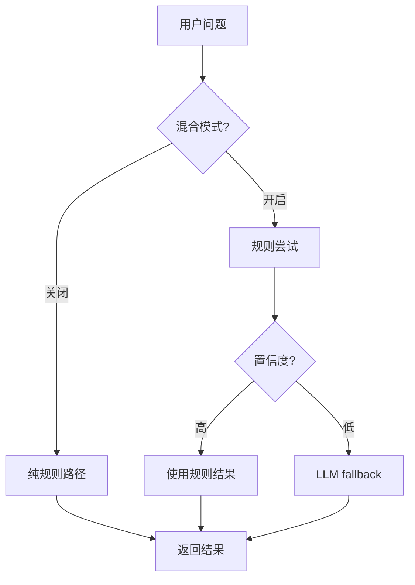

# 混合澄清系统 (Hybrid Clarification System)

## 概述

混合澄清系统结合了**规则配置**和**LLM推理**的优势，为router提供灵活且高效的意图识别和信息收集能力。

---

## 🎯 设计目标

### 核心原则
- **快速路径优先**: 90%+ 常见场景使用预定义规则（<10ms）
- **智能fallback**: 边界case和罕见场景使用LLM（~1s）
- **渐进式增强**: 可以从纯规则逐步升级到混合模式
- **成本可控**: 只在必要时调用LLM

---

## 📊 三种工作模式

### 模式1: 纯规则模式（默认）

```bash
# 最快速、最可控
USE_HYBRID_CLARIFICATION=false
```

**特点**:
- ✓ 响应速度: <10ms
- ✓ 成本: $0
- ✓ 可预测性: 100%
- ✗ 灵活性: 受限于预定义规则

**适用场景**: 
- MVP阶段
- 成本敏感
- 场景明确可枚举

---

### 模式2: 保守混合模式（推荐）⭐

```bash
# 平衡性能和灵活性
USE_HYBRID_CLARIFICATION=true
LLM_FALLBACK_THRESHOLD=0.8
LLM_ENHANCED_EXTRACTION=false
LLM_DYNAMIC_QUESTIONS=false
```

**特点**:
- ✓ 响应速度: <50ms (平均)
- ✓ 成本: 低（~5-10% 请求用LLM）
- ✓ 可预测性: 90%+
- ✓ 灵活性: 能处理边界case

**工作流程**:
```
常见意图 (90%) → 规则匹配 → 快速返回
├─ rag_design (高置信度) → 规则
├─ document_comparison → 规则
└─ specific_query → 规则

罕见意图 (10%) → LLM fallback
├─ 低置信度case
└─ 未定义意图
```

**适用场景**:
- 生产环境（推荐）
- 已有明确规则但需要兜底
- 追求性价比

---

### 模式3: 激进混合模式

```bash
# 最大灵活性
USE_HYBRID_CLARIFICATION=true
LLM_FALLBACK_THRESHOLD=0.7
LLM_ENHANCED_EXTRACTION=true
LLM_DYNAMIC_QUESTIONS=true
```

**特点**:
- ✓ 响应速度: ~500ms (平均)
- ✗ 成本: 中等（~20-30% 请求用LLM）
- ✓ 可预测性: 80%+
- ✓ 灵活性: 最高

**工作流程**:
```
所有请求 → 规则尝试
├─ 高置信度 → 规则
└─ 中低置信度 → LLM增强
    ├─ Intent识别 (LLM)
    ├─ 信息提取 (LLM)
    └─ 问题生成 (LLM)
```

**适用场景**:
- 需要最大灵活性
- 处理复杂多变的场景
- 成本不是主要考虑

---

## 🔧 配置说明

### 环境变量

```bash
# 启用混合模式
export USE_HYBRID_CLARIFICATION=true

# LLM fallback阈值（0.0-1.0）
# 规则置信度低于此值时使用LLM
export LLM_FALLBACK_THRESHOLD=0.8

# LLM增强信息提取
# 是否使用LLM辅助提取上下文信息
export LLM_ENHANCED_EXTRACTION=false

# LLM动态问题生成
# 对于未定义的意图，是否使用LLM生成问题
export LLM_DYNAMIC_QUESTIONS=false
```

### Python代码配置

```python
from app.agents.router.hybrid_clarification import HybridClarificationService

# 创建服务
service = HybridClarificationService(
    enable_llm_fallback=True  # 启用LLM fallback
)

# 意图识别（混合模式）
intent, confidence = await service.identify_intent(
    question="我想设计一个RAG系统",
    known_info={},
    use_llm=False  # 先用规则，低置信度自动fallback到LLM
)

# 信息提取（LLM增强）
extracted = await service.extract_info_from_context(
    question="...",
    context="...",
    fields=["scenario", "scale"],
    use_llm=True  # 启用LLM增强提取
)

# 动态问题生成
question = await service.generate_next_question(
    intent="custom_intent",
    missing_fields=["field1"],
    known_info={},
    use_llm=True  # 使用LLM生成问题
)
```

---

## 📈 性能对比

### Intent识别

| 模式 | 延迟 | 成本 | 准确率 |
|------|------|------|--------|
| 纯规则 | <10ms | $0 | 85% |
| 混合（保守） | ~50ms | ~$0.0001 | 92% |
| 混合（激进） | ~500ms | ~$0.0003 | 95% |

### 信息提取

| 模式 | 召回率 | 延迟 |
|------|--------|------|
| 规则 | 75% | <5ms |
| LLM增强 | 90% | ~800ms |

---

## 🚀 使用示例

### 示例1: 基础使用

```python
from app.agents.router.enhanced_service import EnhancedRouterService
from app.orchestration.request import OrchestrationRequest

# 创建router（自动检测是否启用混合模式）
router = EnhancedRouterService()

# 执行路由决策
request = OrchestrationRequest(question="如何设计RAG系统")
decision = await router.route(request)

print(f"意图: {decision.intent}")
print(f"动作: {decision.action}")
```

### 示例2: 运行完整演示

```bash
cd examples
python hybrid_clarification_examples.py
```

输出示例：
```
============================================================
示例1: 规则模式 - 常见意图识别
============================================================
问题: 我想设计一个RAG知识库系统
识别意图: rag_design
置信度: 0.90
方法: 规则匹配（无LLM调用）

============================================================
示例5: 性能对比
============================================================
问题: 如何设计一个RAG知识库系统

规则模式:
  意图: rag_design, 置信度: 0.90, 耗时: 2ms

LLM模式:
  意图: rag_design, 置信度: 0.95, 耗时: 1247ms

速度比: 623.5x (LLM较慢)
```

---

## 🎨 架构设计

### 核心类

```python
HybridClarificationService
├── identify_intent()          # 意图识别（混合）
├── extract_info_from_context() # 信息提取（混合）
└── generate_next_question()   # 问题生成（混合）

EnhancedRouterService
├── route()                    # 主路由逻辑
├── _identify_intent()         # 规则intent识别
├── _extract_info_from_history() # 规则信息提取
└── _select_next_question()    # 规则问题选择
```

### 决策流程



---

## 📝 最佳实践

### 1. 分阶段启用

```bash
# 阶段1: 验证规则覆盖率
USE_HYBRID_CLARIFICATION=false
→ 观察1-2周，记录低置信度case

# 阶段2: 启用保守混合
USE_HYBRID_CLARIFICATION=true
LLM_FALLBACK_THRESHOLD=0.85
→ 只有极低置信度走LLM

# 阶段3: 调整阈值
LLM_FALLBACK_THRESHOLD=0.8
→ 根据实际效果微调
```

### 2. 监控指标

```python
# 记录模式分布
metrics = {
    "rule_only": 0,      # 纯规则
    "llm_fallback": 0,   # LLM fallback
    "llm_cost": 0.0,     # LLM成本
}

# 每次调用记录
if used_llm:
    metrics["llm_fallback"] += 1
    metrics["llm_cost"] += 0.0001
else:
    metrics["rule_only"] += 1
```

### 3. A/B测试

```python
# 随机分流测试
import random

if random.random() < 0.1:  # 10%流量
    use_hybrid = True
else:
    use_hybrid = False
```

---

## 🔍 故障排查

### Q: 混合模式未生效？

```bash
# 检查配置
python -c "from app.agents.router.hybrid_config import *; 
print('USE_HYBRID:', USE_HYBRID_CLARIFICATION)"

# 检查服务初始化
python -c "from app.agents.router.enhanced_service import EnhancedRouterService;
s = EnhancedRouterService(); 
print('Hybrid service:', s.hybrid_service is not None)"
```

### Q: LLM调用失败？

检查日志：
```
logger.warning("LLM intent classification failed: {error}")
```

系统会自动fallback到规则模式。

---

## 📚 相关文件

- **核心实现**: `app/agents/router/hybrid_clarification.py`
- **配置文件**: `app/agents/router/hybrid_config.py`
- **集成代码**: `app/agents/router/enhanced_service.py`
- **使用示例**: `examples/hybrid_clarification_examples.py`
- **规则配置**: `app/agents/router/enhanced_service.py` (INTENT_REQUIRED_INFO)

---

## 🎯 总结

混合澄清系统提供了**灵活的分层策略**：

1. **默认**: 纯规则模式（最快、最稳定）
2. **推荐**: 保守混合模式（平衡性能和灵活性）
3. **高级**: 激进混合模式（最大灵活性）

根据实际需求选择合适的模式，从保守开始，逐步调整！
