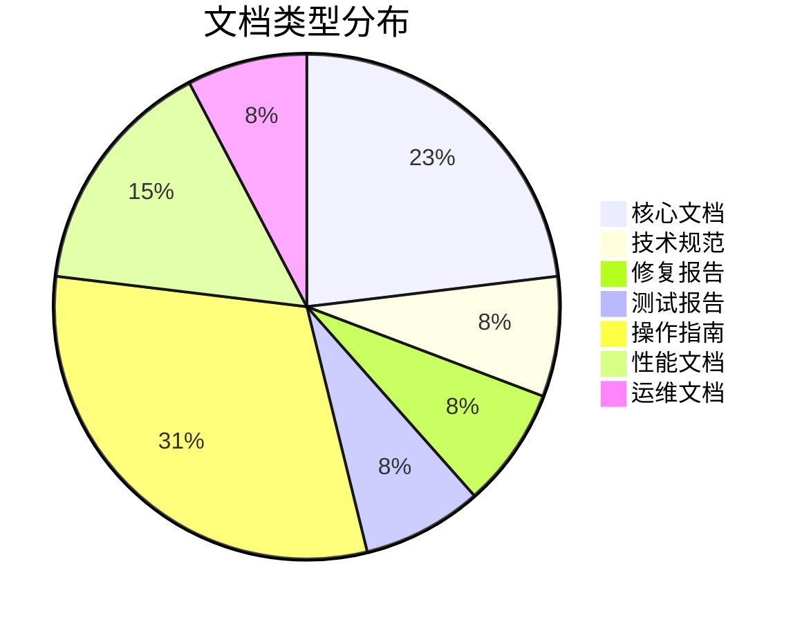
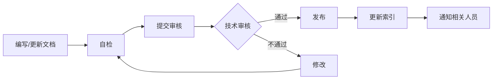

# 技术文档中心

**文档版本**: v1.0.0  
**最后更新**: 2026-04-26  
**维护团队**: 技术文档组  
**项目版本**: v0.2.4

---

## 📚 文档导航

### 核心文档

| 文档 | 描述 | 状态 | 最后更新 |
|------|------|------|----------|
| [CLAUDE.md](../CLAUDE.md) | 项目总体说明和开发指南 | ✅ 最新 | 2026-04-26 |
| [README.md](../README.md) | 项目介绍和快速开始 | ✅ 最新 | 2026-04-26 |
| [CHANGELOG.md](../CHANGELOG.md) | 版本变更历史 | ✅ 最新 | 2026-04-26 |

### 规范文档

| 文档 | 描述 | 状态 | 最后更新 |
|------|------|------|----------|
| [DOCUMENTATION_STANDARD.md](DOCUMENTATION_STANDARD.md) | 文档标准规范 | ✅ 最新 | 2026-04-26 |

### 技术规范

| 文档 | 描述 | 状态 | 最后更新 |
|------|------|------|----------|
| [superpowers/specs/2026-04-19-query-to-answer-ux-speed-design.md](superpowers/specs/2026-04-19-query-to-answer-ux-speed-design.md) | 查询到答案 UX 速度设计 | ✅ 最新 | 2026-04-19 |

### 修复报告

| 文档 | 描述 | 状态 | 最后更新 |
|------|------|------|----------|
| [fixes/2026-04-26-routing-rag-fixes.md](fixes/2026-04-26-routing-rag-fixes.md) | 路由和RAG系统修复报告 | ✅ 最新 | 2026-04-26 |

### 测试报告

| 文档 | 描述 | 状态 | 最后更新 |
|------|------|------|----------|
| [网络功能检查报告.md](网络功能检查报告.md) | 网络搜索功能完整性检查 | ✅ 最新 | 2026-04-26 |

### 操作指南

| 文档 | 描述 | 状态 | 最后更新 |
|------|------|------|----------|
| [API_SETTINGS_GUIDE.md](API_SETTINGS_GUIDE.md) | API 设置配置指南 | ✅ 最新 | 2026-04-20 |
| [claude-api-setup.md](claude-api-setup.md) | Claude API 设置指南 | ✅ 最新 | 2026-04-20 |
| [workflow_lowcode_setup.md](workflow_lowcode_setup.md) | 工作流低代码设置 | ✅ 最新 | 2026-04-15 |
| [如何找到API设置.md](如何找到API设置.md) | API 设置查找指南（中文） | ✅ 最新 | 2026-04-20 |

### 性能文档

| 文档 | 描述 | 状态 | 最后更新 |
|------|------|------|----------|
| [PERFORMANCE_OPTIMIZATION.md](PERFORMANCE_OPTIMIZATION.md) | 性能优化指南 | ✅ 最新 | 2026-04-15 |
| [runtime_speed_profiles.md](runtime_speed_profiles.md) | 运行时速度配置 | ✅ 最新 | 2026-04-15 |

### 运维文档

| 文档 | 描述 | 状态 | 最后更新 |
|------|------|------|----------|
| [production_readiness_checklist.md](production_readiness_checklist.md) | 生产就绪检查清单 | ✅ 最新 | 2026-04-10 |

---

## 📊 文档统计

### 按类型统计

### 按状态统计

| 状态 | 数量 | 占比 |
|------|------|------|
| ✅ 最新 | 13 | 100% |
| 🔄 更新中 | 0 | 0% |
| ⚠️ 待更新 | 0 | 0% |
| 📋 已归档 | 0 | 0% |

---

## 🔍 快速查找

### 按角色查找

**开发人员**:
- [CLAUDE.md](../CLAUDE.md) - 开发指南
- [API_SETTINGS_GUIDE.md](API_SETTINGS_GUIDE.md) - API 配置
- [fixes/2026-04-26-routing-rag-fixes.md](fixes/2026-04-26-routing-rag-fixes.md) - 最新修复

**运维人员**:
- [production_readiness_checklist.md](production_readiness_checklist.md) - 生产检查清单
- [PERFORMANCE_OPTIMIZATION.md](PERFORMANCE_OPTIMIZATION.md) - 性能优化
- [runtime_speed_profiles.md](runtime_speed_profiles.md) - 速度配置

**测试人员**:
- [网络功能检查报告.md](网络功能检查报告.md) - 功能测试报告
- [fixes/2026-04-26-routing-rag-fixes.md](fixes/2026-04-26-routing-rag-fixes.md) - 修复验证

**产品经理**:
- [README.md](../README.md) - 产品介绍
- [CHANGELOG.md](../CHANGELOG.md) - 版本历史
- [superpowers/specs/2026-04-19-query-to-answer-ux-speed-design.md](superpowers/specs/2026-04-19-query-to-answer-ux-speed-design.md) - UX 设计

### 按主题查找

**架构设计**:
- [CLAUDE.md](../CLAUDE.md) - 系统架构
- [superpowers/specs/2026-04-19-query-to-answer-ux-speed-design.md](superpowers/specs/2026-04-19-query-to-answer-ux-speed-design.md) - 分层执行设计

**配置管理**:
- [API_SETTINGS_GUIDE.md](API_SETTINGS_GUIDE.md) - API 设置
- [claude-api-setup.md](claude-api-setup.md) - Claude API
- [workflow_lowcode_setup.md](workflow_lowcode_setup.md) - 工作流配置

**性能优化**:
- [PERFORMANCE_OPTIMIZATION.md](PERFORMANCE_OPTIMIZATION.md) - 优化指南
- [runtime_speed_profiles.md](runtime_speed_profiles.md) - 速度配置
- [fixes/2026-04-26-routing-rag-fixes.md](fixes/2026-04-26-routing-rag-fixes.md) - 性能修复

**质量保证**:
- [网络功能检查报告.md](网络功能检查报告.md) - 功能测试
- [production_readiness_checklist.md](production_readiness_checklist.md) - 生产检查
- [fixes/2026-04-26-routing-rag-fixes.md](fixes/2026-04-26-routing-rag-fixes.md) - 修复验证

---

## 📝 文档规范

所有文档遵循 [文档标准规范](DOCUMENTATION_STANDARD.md)，包括：

- ✅ 统一的元数据格式
- ✅ 标准化的章节结构
- ✅ 语义化版本控制
- ✅ 完整的变更历史
- ✅ 清晰的时间线管理

---

## 🔄 文档更新流程

### 更新频率

| 文档类型 | 更新触发条件 | 审核周期 |
|---------|-------------|----------|
| 核心文档 | 重大变更 | 每月 |
| 技术规范 | 新功能设计 | 按需 |
| 修复报告 | Bug 修复 | 按需 |
| 测试报告 | 功能测试 | 按需 |
| 操作指南 | 配置变更 | 季度 |
| 性能文档 | 性能优化 | 季度 |

---

## 📞 联系方式

**文档维护团队**: tech-docs@example.com  
**技术支持**: tech-support@example.com  
**问题反馈**: [GitHub Issues](https://github.com/your-org/multi-agent-rag/issues)

---

## 📅 文档审核计划

| 文档 | 下次审核日期 | 负责人 | 状态 |
|------|-------------|--------|------|
| CLAUDE.md | 2026-05-26 | 技术负责人 | 📋 已排期 |
| 网络功能检查报告 | 2026-07-26 | 测试组 | 📋 已排期 |
| 路由和RAG修复报告 | 2026-07-26 | 后端组 | 📋 已排期 |
| 文档标准规范 | 2026-07-26 | 文档组 | 📋 已排期 |

---

## 变更历史

| 版本 | 日期 | 作者 | 变更说明 |
|------|------|------|----------|
| v1.0.0 | 2026-04-26 | 文档组 | 创建文档中心索引 |

---

**最后更新**: 2026-04-26  
**文档状态**: [已发布]
